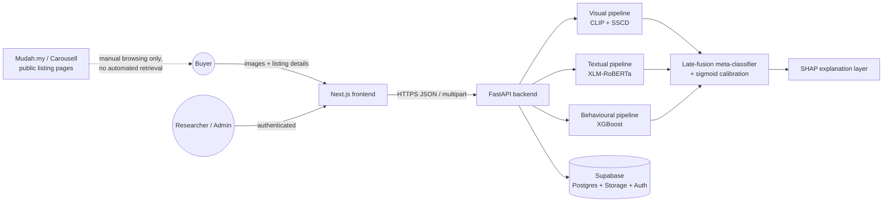
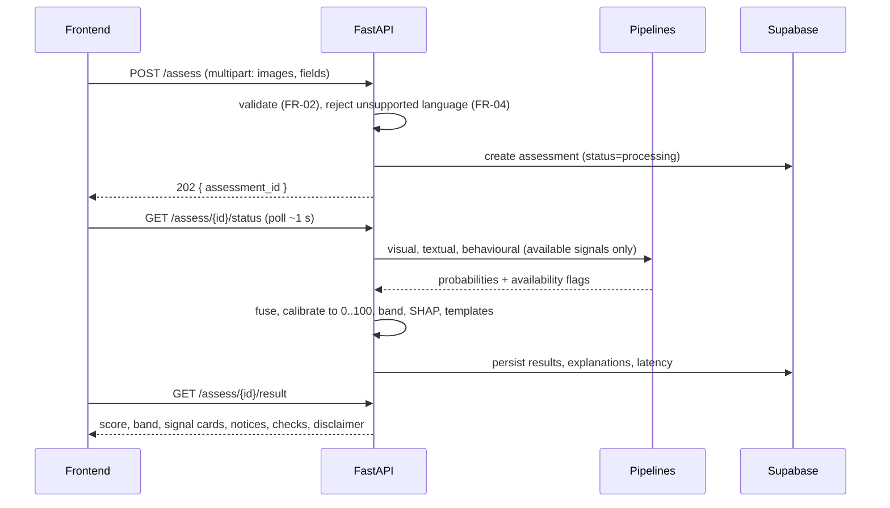

# GuardianLens: Technical Design Document (TDD)

**Status:** Working draft for supervisor review.
**Framing note:** The template heading "Recommended Tech Stack" does not apply here. The stack was committed in Documentation I and Chapter 3 and is frozen; re-recommending it now would contradict the frozen documents. Section 2 therefore records the committed stack with its rationale and the alternative each choice was weighed against, so every decision has a ready viva answer. Sections 5 to 7 contain new engineering detail (proposals P-1, P-2, P-5 in document 00) that must be confirmed before build.

---

## 1. System summary

Client-server web application. The Next.js and TypeScript frontend collects listing data and displays the assessment. A FastAPI backend validates the request, preprocesses inputs, runs the three signal pipelines, fuses their probabilities with the trained meta-classifier, calibrates the result to a 0 to 100 score with a Low / Moderate / High band, converts SHAP values into per-signal explanations, and persists anonymised records to Supabase. (Ch3 s.3.3.7; the "0 - 10" wording there is a known typo, see document 00 s.6.)

---

## 2. Committed technology stack (locked in Documentation I; do not re-open)

| Layer | Technology | Role | Recorded rationale | Alternative considered and why rejected | Primary failure mode to watch |
| --- | --- | --- | --- | --- | --- |
| Frontend | Next.js + TypeScript | Listing submission form; result, explanation, history, feedback, and admin screens | Mature React framework, type safety, fast local development | Plain React SPA: loses file-based routing and API co-location; no benefit for this scope | Bundle bloat and hydration cost on low-end phones; mitigate with the 375 px viewport check (NFR-03) |
| Backend / API | FastAPI (Python) | Single orchestration layer: validate, preprocess, run pipelines, fuse, explain, persist | Same language as the models, async, auto-generated docs | Next.js API routes (Node): would force cross-language model serving or a second service anyway | Cold-start model loading; blocking the event loop with CPU-bound inference (see s.6) |
| Visual | CLIP; SSCD | CLIP: image-description consistency. SSCD: copy detection against the approved reference corpus | Pretrained, purpose-fit; no training data demands on the small dataset | Training a bespoke CNN: infeasible at this dataset size; ViT fine-tuning: same problem plus compute cost | Corpus-bounded recall: SSCD only flags reuse within the corpus (a stated limitation, and the explanation must say so) |
| Textual | XLM-RoBERTa, fine-tuned | Classify Malay, English, and mixed listing text | Multilingual encoder covering Malay; established classification fine-tuning path; stronger than mBERT in the cited literature | mBERT: weaker multilingual performance in the cited comparisons; English-only models: fail the language requirement outright | Overfitting on a small, imbalanced dataset; controlled with class weights, early stopping, stratified validation (Ch3 s.3.3.8) |
| Behavioural | XGBoost | Score structured seller and listing features | Strong on small, imbalanced tabular data; exact TreeSHAP, which the explanation layer depends on | Neural tabular model: needs more data, loses exact attribution, adds tuning burden with no evidence of benefit at this scale | Sparse features at assessment time; missingness is represented explicitly and never auto-read as suspicious (FR-06) |
| Fusion | scikit-learn meta-classifier, logistic regression baseline | Late fusion of three probabilities plus availability indicators | Simple, interpretable; fusion is not the claimed novelty; keeps per-component evaluation clean for RQ1 and ablation for RQ3 | Joint end-to-end multimodal training: may capture raw-level interactions but destroys clean component evaluation, complicates SHAP, and demands far more data. The cost (missed low-level interactions) is accepted and documented in Ch3 s.3.3.7 | Leakage into fusion training; prevented by out-of-fold component probabilities (five-fold stratified CV, Ch3 s.3.3.8) |
| Calibration | CalibratedClassifierCV, sigmoid | Calibrated 0 to 100 score | Standard, checkable with Brier score and reliability plot | Isotonic calibration: risks overfitting at this sample size | Miscalibration in the minority class region; the reliability plot check is the control |
| Explainability | SHAP | Per-signal contributions rendered as plain-language templates | Additive and consistent; exact TreeSHAP for XGBoost; works on the linear fusion layer | LIME: sampling instability, no exactness guarantee for trees | Explanation-induced over-reliance (Bansal et al., 2021); countered by the study's over-reliance metric and decision-support framing |
| Data / storage | Supabase (managed Postgres, auth, storage) | Anonymised listing records, model registry, assessment outputs, study responses | Managed Postgres, built-in auth for the admin surface, object storage, free tier | Self-hosted Postgres: adds operations burden with zero research value | Free-tier limits and project pausing (open item O-6); mitigated by storing derived features and hashes rather than bulky raw data where possible |
| Training environment | Google Colab free T4 (primary), Kaggle (backup) | XLM-RoBERTa fine-tuning; heavy feature extraction | Free GPU access adequate for one encoder fine-tune | Paid cloud GPU: unjustified while free tiers suffice; Colab Pro only if real throttling occurs near a training deadline (project decision) | Session timeouts; controlled by Drive checkpointing every epoch and resumable training scripts |

---

## 3. Architecture overview

### 3.1 Context



The dotted edge is deliberate: the platforms are a data *context*, not an integration. Nothing in the system fetches from them.

### 3.2 Assessment request lifecycle



Rationale for asynchronous submit-then-poll rather than one blocking call: the 10-second budget (NFR-02) leaves no room for a hung request with no feedback, and Screen 3 requires staged progress. Polling at about one second gives the frontend honest stage updates with trivial infrastructure. Alternative considered: server-sent events; rejected for now as added complexity without a requirement behind it (revisit only if polling proves janky in Phase D testing).

### 3.3 Module layout (repository structure, proposal)

```
guardianlens/
  frontend/            Next.js app (screens 1 to 7)
  api/
    main.py            app factory, startup model loading
    routers/           assess.py, feedback.py, admin.py, export.py
    services/          visual.py, textual.py, behavioural.py, fusion.py, explain.py
    models/            loader.py (bundle loading), registry.py
    schemas.py         Pydantic request/response models
    settings.py        env-driven config; no secrets in code (NFR-06)
  ml/
    configs/           YAML per experiment: seed, data version, hyperparameters
    src/               features/, train_text/, train_behavioural/, fusion/, eval/, ablation/
    notebooks/         Colab notebooks, versioned, pinned dependencies
  db/migrations/       SQL, ordered, idempotent
  research/            splits, study materials, export snapshots
  docs/                these documents; incremental Chapter 4 drafts
```

Modularity here is what NFR-09 will be audited against: the five components (visual, textual, behavioural, fusion, explanation) are separate services with independent versions.

---

## 4. APIs and integrations

| Integration | Type | Notes |
| --- | --- | --- |
| Supabase | First-party dependency | Postgres, object storage for images and model artefacts metadata, auth for the admin surface. Access topology is proposal P-2 (s.7). |
| Hugging Face model hub (or equivalent source repos) | Download-time only | Pretrained CLIP, SSCD, and XLM-RoBERTa weights fetched once into the training and serving environments. Licence verification is open item O-5; no licence terms are asserted here. |
| Google Colab / Kaggle | Training-time only | Not part of the served system. |
| Semak Mule (PDRM/NSRC) | None (manual link-out) | Appears only inside the suggested-checks list as a step the buyer performs independently. No API is claimed or used; no affiliation is implied. |
| Third-party paid APIs | None | Deliberately zero; the project has no budget and no requirement for them. |

There is no scraping, crawling, or automated listing retrieval anywhere in the system. This is a terms-of-service constraint, not an implementation gap, and it should be stated exactly that way in the viva.

---

## 5. API contract (proposal P-5)

All endpoints JSON over HTTPS unless multipart is stated. Errors follow one envelope: `{ "error": { "code": string, "message": string, "field": string | null } }` with correct HTTP status codes. Error messages identify what must be corrected without discarding valid input already entered (Ch3 s.3.3.6).

| Method and path | Purpose | Request | Response | Requirement |
| --- | --- | --- | --- | --- |
| POST `/api/v1/assess` | Submit a listing | multipart: `images[]` (1 to N files, capped count and size), `title`, `description`, `price`, `category`, optional seller fields (`account_age_days`, `rating`, `review_count`, `active_listing_count`) | 202 `{ assessment_id }` or 422 validation error | FR-01, FR-02 |
| GET `/api/v1/assess/{id}/status` | Poll progress | path id + session token | `{ status, stage }` where stage is one of `visual`, `textual`, `behavioural`, `fusion`, `explanation` | Screen 3 |
| GET `/api/v1/assess/{id}/result` | Fetch result | path id + session token | score 0 to 100, band, per-signal cards (probability, availability, top SHAP reasons as display text), missing-data notices, suggested checks, disclaimer text, model bundle label | FR-08 to FR-10 |
| POST `/api/v1/assess/{id}/feedback` | Buyer feedback | `{ verdict: helpful | unclear | potentially_incorrect, comment? }` | 204 | FR-12 |
| GET `/api/v1/session/history` | Session history | session token | list of `{ assessment_id, title, score, band, created_at }` for this session only | FR-13 |
| POST `/api/v1/admin/login` and admin CRUD (`/admin/corpus`, `/admin/bundles`, `/admin/records`) | Restricted administration | Supabase-authenticated admin only | corpus items, model bundles, anonymised records | UR-07, Screen 7 |
| GET `/api/v1/admin/export` | Anonymised exports | admin only; `?dataset=outputs|study` | CSV per the export integrity check | FR-14 |

Validation limits (initial values, to be finalised in Phase D against real files): image types JPEG, PNG, WebP; per-file size cap and per-assessment image count cap enforced server-side; text length caps on title and description; price must parse as a non-negative number. Chinese-dominant text detected at validation returns the FR-04 unsupported-language response rather than a silent low-quality assessment.

---

## 6. Model serving and the 10-second budget (proposal P-1)

Chapter 3 fixes FastAPI but not a hosting environment, and NFR-02 fixes a 10-second end-to-end budget under prototype test conditions. This is the single largest unquantified technical risk in the build, so it is handled as a measured decision, not an assumption.

**What is known:** all inference is CPU-viable in principle (single-item batches; CLIP and XLM-RoBERTa base-class encoders; SSCD descriptor plus nearest-neighbour search over a small corpus; XGBoost and logistic regression are negligible). **What is not known:** actual per-stage latency on the target machine, and cold-start model-loading time. No latency figures are asserted here; task GL-P0-03 in the Engineering Plan is an early spike that loads every model on CPU and measures each stage against the 10-second budget with one to three images. The result of that spike, not intuition, decides whether mitigation is needed.

Mitigations in order of preference if the spike fails the budget: cap image count harder at validation; precompute and cache the reference-corpus index at startup; switch CLIP or XLM-R to a smaller published variant (a model-choice change inside the locked architecture, recorded in the registry); only then consider quantisation.

Hosting options for FYP2:

| Option | Cost | Fit | Risks |
| --- | --- | --- | --- |
| A. Local machine, demonstrated live (baseline) | Zero | Guaranteed warm models; full control during viva and lab-based user-study sessions | Not remotely reachable; single point of failure on demo day (mitigate with a recorded fallback run) |
| B. Free CPU host (for example Hugging Face Spaces or a free web service tier) | Zero | Needed only if user-study participants join remotely | Cold starts can exceed the whole 10-second budget; free tiers sleep; multi-gigabyte model images may exceed limits. Current limits must be checked at decision time, not assumed |
| C. Paid cloud VM | Non-zero | Overkill | Unjustified by requirements; conflicts with the free-tier constraint |

**Recommendation (pending Dr. Rajabi confirmation):** develop and demo on Option A; adopt Option B only if the confirmed study protocol requires remote participation, and only after a deployed latency re-test. Decision deadline: end of Phase D week 1 (see document 06).

---

## 7. Data access topology (proposal P-2)

Two viable topologies for buyer-facing data:

| Topology | How it works | Strengths | Weaknesses |
| --- | --- | --- | --- |
| A. API-mediated (recommended) | The browser talks only to FastAPI. FastAPI holds the Supabase service key server-side and enforces session ownership on every read and write. Supabase RLS denies anonymous access entirely; RLS plus Supabase Auth protect only the admin surface. | One enforcement point; no Supabase credentials or session semantics in the browser; NFR-05 satisfied because a server-issued opaque session token (httpOnly cookie) is the only identifier a buyer ever has | FastAPI becomes a hard dependency for every read; ownership checks must be tested explicitly (they are: Phase D security tasks) |
| B. Supabase anonymous sign-in + RLS | The browser gets an anonymous Supabase identity; RLS policies scope rows to `auth.uid()` | Uniform RLS story; less API surface | Depends on anonymous-auth availability and behaviour on the current plan (would need verification); spreads access logic across policies and client; a policy mistake exposes data directly |

Topology A is recommended because it keeps the trust boundary in one audited place and does not rest on an unverified platform feature. The schema in document 05 is written for A but is compatible with B.

---

## 8. Security design (NFR-06, OWASP-checklist scope)

- **Secrets:** service keys and model paths from environment only; a secret-scanning check runs before every push (Table 3.9 audit).
- **Input handling:** server-side validation of type, size, count, and length; images re-encoded on ingest to strip metadata and neutralise malformed files; text treated as data, never rendered as HTML.
- **Access control:** admin endpoints require Supabase-authenticated users with the admin role; buyer endpoints require a valid session token that owns the requested assessment; object storage buckets are private, served via short-lived signed URLs.
- **Transport:** HTTPS only; httpOnly, SameSite cookies for the session token.
- **Abuse limits:** per-session rate limit on `/assess` to protect the free-tier budget and the 10-second SLO for others.
- **Logging:** structured logs exclude uploaded content and any seller text; identifiers are the pseudonymous ones defined in document 05.

---

## 9. Reproducibility and the model registry (NFR-07, NFR-09, FR-11)

Every deployable set of artefacts is a **model bundle**: pinned versions of the visual thresholds, textual checkpoint, behavioural model, fusion model, calibrator, band boundaries, and explanation template set, plus the dataset version and seed that produced each. Bundles are immutable and labelled; every stored assessment records the bundle label, which is what makes the FR-11 repeatability test possible ("same input, same bundle, same output, excluding documented non-determinism"). Training runs are only valid if they record: fixed seed, pinned dependency list, versioned notebook or script, data split hashes, and an archived checkpoint. This is the project's standing reproducibility rule and it is a phase-gate criterion in document 06, not an aspiration.

---

## 10. Known constraints, risks, and their owners

| Risk | Impact | Control | Status |
| --- | --- | --- | --- |
| CPU latency breaks NFR-02 | Failed performance requirement | GL-P0-03 latency spike with a hard gate; mitigation ladder in s.6 | Open until measured |
| Colab throttling near a training deadline | Blocked fine-tuning | Kaggle backup, epoch-level Drive checkpoints, Colab Pro only on evidenced throttling | Standing control |
| Supabase free-tier limits or project pausing | Data loss or blocked study | Confirm current limits at Phase D start (O-6); nightly export of research-critical tables | Open |
| Pretrained weight licences unsuitable | Rework of a pipeline | Verify before Phase B (O-5); record in registry | Open |
| Single developer, 13-week window | Schedule slip | Buffer week, incremental Chapter 4, phase gates that fail loudly rather than silently | Standing |
| Fraud-positive scarcity | Underpowered models | Pilot gate with Tier C escalation to Dr. Rajabi | Standing control |
