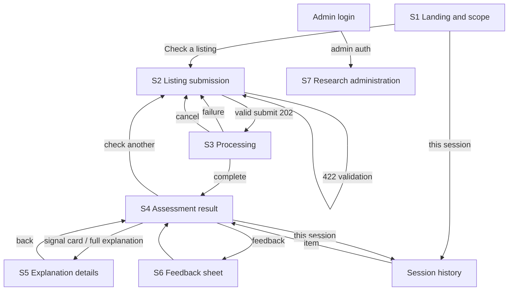

# GuardianLens: App Flow and User Journeys

**Status:** Working draft for supervisor review.
**Anchor:** The screen set is fixed by Chapter 3 Table 3.6 (Screens 1 to 7) and the interface principles in s.3.3.6: plain language, progressive disclosure, mobile responsiveness, visible uncertainty, no colour-only risk communication, no false precision, retention behaviour explained near the submission control, and error messages that preserve valid input. Navigation logic below is new engineering detail consistent with those screens (no new screens are introduced). Session identity follows proposal P-3 (opaque session token, no account required for buyers).

---

## 1. Screen inventory

| ID | Screen (Ch3 name) | Route (proposal) | Required content (Ch3) |
| --- | --- | --- | --- |
| S1 | Landing and scope | `/` | What GuardianLens checks, what it cannot guarantee, how uploaded data are handled |
| S2 | Listing submission | `/assess` | Image upload; title, description, price, category; optional seller information; retention notice near the submit control |
| S3 | Processing | `/assess/[id]/processing` | Progress across visual, textual, behavioural, fusion, and explanation stages, without exposing internal errors |
| S4 | Assessment result | `/assess/[id]` | Overall score, risk band, three signal cards, missing-data notice, suggested checks, disclaimer |
| S5 | Explanation details | `/assess/[id]/explanation` | Expanded reasons and evidence, including the scope of reference-image matching |
| S6 | Feedback | `/assess/[id]/feedback` (or inline sheet on S4) | Helpful / unclear / potentially incorrect, optional comment, no sensitive data requested |
| S7 | Research administration | `/admin` (auth-gated) | Model versions, dataset records, anonymised exports, reference-corpus management |

Session history (FR-13) is not a separate Ch3 screen; it is rendered as a panel reachable from S1 and S4 (`/history`), listing this session's assessments only.

---

## 2. Onboarding flow (first-time buyer)

Buyers need no account, so onboarding is deliberately thin: it exists to set expectations (NFR-10) and collect nothing.

1. **Arrive at S1.** Above the fold: one-sentence description, a "Check a listing" primary button, and three short blocks answering, in order, what is checked (three signals, plain words), what is not guaranteed (decision support, not a verdict), and what happens to uploads (anonymised metadata only, kept for the approved retention period; wording finalised when O-4 resolves).
2. **Tap "Check a listing" → S2.** No interstitials, no tour. The interface must teach itself through use (Paradox of the Active User; see the UX-laws audit in document 04).
3. **First submission on S2** doubles as the tutorial: field hints show what to copy from the listing page ("copy the title exactly as shown", "seller info is optional; leave blank if not visible"). A first-visit-only dismissible note explains that leaving seller fields blank marks that signal as unavailable rather than suspicious (FR-06 in user language).
4. **S3 → S4** completes the first run. The end of the first result is the moment the mental model forms, so S4 always renders the disclaimer and the "what this means" one-liner under the score, not behind a tap.

Exit criterion for onboarding design: a first-time user completes submit-and-understand without training, which is exactly the NFR-01 usability measure.

---

## 3. Key user journeys

### J1: Assess a listing (core journey, FR-01 to FR-10)

Preconditions: buyer has a Mudah.my or Carousell listing open in another tab or app; GuardianLens open at S1.

| Step | User action | System behaviour | Screen |
| --- | --- | --- | --- |
| 1 | Tap "Check a listing" | Navigate to S2; issue session token if absent | S1→S2 |
| 2 | Add 1 to N photos (drag-drop or file picker; camera on mobile) | Client-side type and size pre-check with immediate per-file feedback; server re-validates on submit (FR-02) | S2 |
| 3 | Paste title and description; enter price; pick category; optionally fill seller fields | Inline validation on blur; price parsed as a number; text length caps shown as counters | S2 |
| 4 | Tap "Assess listing" | POST `/assess`; on 422, errors point at exact fields and all valid input is preserved (Ch3 s.3.3.6); on 202, navigate to S3 | S2→S3 |
| 5 | Wait | Five-stage progress (visual → textual → behavioural → fusion → explanation) via status polling; stages the buyer can read, no internal errors surfaced; skeleton appears immediately | S3 |
| 6 | Automatic on completion | Navigate to S4; score counts up to its value once, band and icon shown with text label; three signal cards; missing-signal notices; suggested checks; disclaimer | S3→S4 |
| 7 | Optional: tap a signal card or "See full explanation" | Navigate to S5 with the tapped card expanded | S4→S5 |

Failure branches: (a) unsupported language detected → 422 with the FR-04 message on S2, listing stays editable; (b) backend failure mid-run → S3 swaps to a calm failure state ("the check could not be completed; nothing was charged or stored beyond the attempt record") with "Try again" returning to a pre-filled S2; (c) processing exceeds the expected window → S3 keeps honest stage text and adds "taking longer than usual", never a fake percentage.

### J2: Understand the result in depth (FR-09, NFR-04, UR-04, UR-05)

1. From S4, tap the visual card → S5 opens on the visual section: CLIP consistency statement in plain words, and, if an SSCD match fired, the exact bounded claim: the photo matches an image *in the project's reference set*, which indicates reuse within that set and nothing more (Ch3 s.3.3.8 wording rule).
2. Scroll S5: textual reasons (top SHAP-backed indicators rendered from templates), behavioural reasons with any missing fields listed as "not provided, treated as unknown".
3. Bottom of S5: suggested manual checks (including checking the seller's account via Semak Mule independently) and the disclaimer again. Back returns to S4 with scroll position preserved.

### J3: Give feedback (FR-12)

From S4, tap "Was this helpful?" → S6 sheet: three options (helpful / unclear / potentially incorrect), optional free-text comment with an explicit "do not include personal details" hint, submit → confirmation toast on S4. One feedback record per assessment; re-opening shows the previous choice and allows changing it.

### J4: Revisit this session's checks (FR-13)

From S1 or S4 header, tap "This session" → `/history`: reverse-chronological list (title, thumbnail, score, band, time). Tap an item → its S4. Copy states plainly that history lives only in this browser session and is gone when the session ends (cross-login history is future work, per Ch3 s.3.1.7).

### J5: Administer the research system (UR-07, FR-14, Screen 7)

1. Navigate to `/admin` → Supabase-auth login; non-admin roles are rejected with no information leakage.
2. Dashboard tabs: **Model bundles** (list, labels, per-component versions, activate exactly one), **Reference corpus** (list with hashes and provenance notes, add with mandatory source note, deactivate; never silent delete), **Records** (anonymised assessments, filter by date and band), **Exports** (outputs CSV, study CSV; each export logged).
3. Export → file downloads; the export integrity check (Table 3.9) runs against these files during evaluation.

### J6: Edge and safety journeys

| Case | Handling | Source |
| --- | --- | --- |
| No seller information available on the listing | Buyer leaves fields blank; behavioural card renders as "limited information: treated as unknown, not as suspicious"; fusion receives availability flags | FR-05, FR-06 |
| Only one photo, low resolution | Accepted if it passes validation; visual card notes reduced confidence rather than refusing | FR-06, s.3.3.6 uncertainty principle |
| Chinese-language listing | Blocked at validation with a plain explanation and no partial score | FR-04 |
| Oversized or wrong-type file | Rejected per file with the reason; other files and all text kept | FR-02, s.3.3.6 |
| Buyer refreshes S3 | Status endpoint is idempotent; page resumes polling the same assessment | Engineering detail |
| Buyer deep-links another session's result | Ownership check fails; generic not-found response (no existence leakage) | NFR-05, NFR-06 |

---

## 4. Screen-by-screen navigation map

Explicit control → destination logic. "Persistent header" = compact top bar on every buyer screen with the wordmark (→ S1) and "This session" (→ history).

| Screen | Control | Action / destination |
| --- | --- | --- |
| S1 | "Check a listing" (primary) | → S2 |
| S1 | "How it works" (secondary) | Scrolls to the three explainer blocks on S1 (no new page) |
| S1 | "This session" | → history panel |
| S2 | Per-file remove icon | Removes that file only |
| S2 | "Assess listing" (primary, disabled until mandatory fields valid) | POST; → S3 on 202; inline field errors on 422 |
| S2 | Back (header wordmark) | → S1; entered data kept for the session (draft state) |
| S3 | (no user controls except Cancel) | Auto → S4 on completion |
| S3 | "Cancel" | Abandons polling; → S2 pre-filled; server marks the run abandoned |
| S3 failure state | "Try again" | → S2 pre-filled |
| S4 | Signal card (any of three) | → S5 anchored to that signal |
| S4 | "See full explanation" | → S5 top |
| S4 | "Was this helpful?" | Opens S6 sheet over S4 |
| S4 | "Check another listing" | → S2 (cleared form) |
| S4 | "This session" | → history panel |
| S5 | Back | → S4 (scroll preserved) |
| S5 | Semak Mule link inside suggested checks | Opens the official Semak Mule site in a new tab; GuardianLens makes no claim about the outcome |
| S6 | "Submit feedback" | Saves; closes sheet; toast on S4 |
| S6 | Close / outside tap | Closes without saving |
| History | List item | → that item's S4 |
| S7 login | Valid admin credentials | → S7 dashboard |
| S7 tabs | Bundles / Corpus / Records / Exports | Switch panels in place |
| S7 "Export" buttons | Generates and downloads CSV; writes an export log row |

### Flow diagram

---

## 5. Interaction principles carried from Chapter 3 (binding on all screens)

1. Risk is always text plus number plus icon; colour is reinforcement only (NFR-08, s.3.3.6).
2. The score shows no false precision: an integer from 0 to 100, never decimals.
3. Every screen that shows a score also shows the disclaimer (NFR-10); it is copy, not a dismissible banner.
4. Missing data is always named and always framed as unknown, never as safe and never as suspicious (FR-06).
5. Errors never destroy entered input (s.3.3.6).
6. The retention statement sits beside the submit control on S2, in the same visual group (s.3.3.6; exact wording pends O-4).
