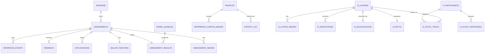

# GuardianLens: Backend Schema (Supabase / Postgres)

**Status:** Working draft for supervisor review. This whole document is proposal P-6 (document 00): Chapter 3 fixes the storage platform (Supabase), the field groups (Table 3.7), and the privacy rules (FR-11, NFR-05 to NFR-07), but not table-level design. The design below is the elaboration to be confirmed before the first migration runs. Written for access topology A (API-mediated; document 02 s.7); compatible with topology B.

---

## 1. Design rules the schema must obey

1. **Anonymised metadata only** (FR-11): no names, contact details, marketplace usernames, or account numbers anywhere. Seller identity never exists in the database; only pseudonymous listing and assessment IDs do.
2. **PII scrub before persist:** listing titles and descriptions can contain phone numbers or emails typed by sellers. A scrub pass (pattern-based redaction) runs before any text is stored; the raw submitted text lives only in process memory during the assessment. The scrub itself is a Phase D test target.
3. **Reproducibility:** every result row records the immutable model bundle that produced it (NFR-07, FR-11 repeatability test).
4. **Missingness is data:** behavioural fields are nullable with explicit flags; NULL never silently means safe or suspicious (FR-06).
5. **Two worlds, two schemas:** the buyer-facing product lives in schema `public`; the research dataset and user-study data live in schema `research`. Nothing in `public` references `research` and the reverse; exports bridge them (FR-14). This keeps the product database auditable against NFR-05 without dragging the research data into every review.
6. **Retention:** rows and stored images carry `created_at` and are purged after the approved retention period (value pends open item O-4); the purge job writes to `export_log`-style audit rows so the NFR-05 retention audit has evidence.

---

## 2. Schema `public`: product tables

Types are Postgres. PK = primary key, FK = foreign key, U = unique, N = nullable. `gen_random_uuid()` defaults on all UUID PKs; `now()` defaults on all `created_at`.

### 2.1 `profiles` (admin identities only; buyers have no profiles)

| Field | Type | Constraints | Notes |
| --- | --- | --- | --- |
| id | uuid | PK, FK → auth.users(id) on delete cascade | Supabase auth user |
| role | text | NOT NULL, CHECK (role IN ('admin')) DEFAULT 'admin' | Only admins get rows; absence of a row = no admin rights |
| display_name | text | N | |
| created_at | timestamptz | NOT NULL | |

### 2.2 `sessions` (anonymous buyer sessions, proposal P-3)

| Field | Type | Constraints | Notes |
| --- | --- | --- | --- |
| id | uuid | PK | Server-issued; the value inside the httpOnly cookie is an opaque token mapped to this row, never exposed in URLs |
| created_at | timestamptz | NOT NULL | |
| last_seen_at | timestamptz | NOT NULL | Session expiry basis |
| user_agent_class | text | N, CHECK (user_agent_class IN ('mobile','tablet','desktop')) | Coarse only; no raw user-agent strings (NFR-05) |

### 2.3 `assessments`

| Field | Type | Constraints | Notes |
| --- | --- | --- | --- |
| id | uuid | PK | Pseudonymous assessment ID |
| session_id | uuid | NOT NULL, FK → sessions(id) | Ownership for FR-13 and access checks |
| platform | text | NOT NULL, CHECK (platform IN ('mudah','carousell','other')) | Buyer-declared |
| title_scrubbed | text | NOT NULL | Post-scrub |
| description_scrubbed | text | NOT NULL | Post-scrub |
| category | text | NOT NULL | From the curated category list |
| price | numeric(12,2) | NOT NULL, CHECK (price >= 0) | |
| currency | char(3) | NOT NULL DEFAULT 'MYR' | |
| language_detected | text | NOT NULL, CHECK (language_detected IN ('ms','en','mixed','unsupported')) | 'unsupported' rows never proceed to results (FR-04) |
| status | text | NOT NULL, CHECK (status IN ('processing','complete','failed','abandoned')) | |
| created_at | timestamptz | NOT NULL | Retention clock |
| completed_at | timestamptz | N | |

### 2.4 `assessment_images` (one-to-many from assessments)

| Field | Type | Constraints | Notes |
| --- | --- | --- | --- |
| id | uuid | PK | |
| assessment_id | uuid | NOT NULL, FK → assessments(id) on delete cascade | |
| storage_path | text | NOT NULL | Private bucket `listing-images/` (s.5) |
| sha256 | char(64) | NOT NULL | Dedup, audit (Table 3.7 "file hash") |
| mime | text | NOT NULL, CHECK (mime IN ('image/jpeg','image/png','image/webp')) | |
| width_px | integer | NOT NULL | |
| height_px | integer | NOT NULL | |
| position | smallint | NOT NULL | U (assessment_id, position) |

### 2.5 `seller_features` (one-to-one with assessments; behavioural inputs)

| Field | Type | Constraints | Notes |
| --- | --- | --- | --- |
| assessment_id | uuid | PK, FK → assessments(id) on delete cascade | |
| account_age_days | integer | N, CHECK (account_age_days >= 0) | Buyer-entered from the visible listing page |
| rating | numeric(3,2) | N, CHECK (rating BETWEEN 0 AND 5) | |
| review_count | integer | N, CHECK (review_count >= 0) | |
| active_listing_count | integer | N, CHECK (active_listing_count >= 0) | |
| missing_flags | jsonb | NOT NULL | One boolean per feature above; the explicit missingness representation the model consumes |

Derived features (listing velocity, price deviation from category baseline) are computed at inference from these inputs plus reference statistics inside the model bundle; they are stored on the result row, not here, because they depend on the bundle version.

### 2.6 `model_bundles` (registry; NFR-09, FR-11)

| Field | Type | Constraints | Notes |
| --- | --- | --- | --- |
| id | uuid | PK | |
| label | text | NOT NULL, U | e.g. `bundle-2026-09-r1` |
| visual_version | text | NOT NULL | CLIP variant + thresholds artefact reference |
| textual_version | text | NOT NULL | XLM-R checkpoint reference |
| behavioural_version | text | NOT NULL | XGBoost artefact reference |
| fusion_version | text | NOT NULL | Meta-classifier artefact reference |
| calibrator_version | text | NOT NULL | |
| band_boundaries | jsonb | N | NULL until fixed during evaluation (open item O-7); results cannot render a band from a bundle with NULL boundaries |
| dataset_version | text | NOT NULL | Split hash reference |
| seeds | jsonb | NOT NULL | Per-component training seeds |
| category_baselines | jsonb | NOT NULL | Price baselines used for the deviation feature |
| is_active | boolean | NOT NULL DEFAULT false | Partial unique index enforces at most one active bundle |
| created_at | timestamptz | NOT NULL | |
| notes | text | N | |

### 2.7 `assessment_results` (one-to-one with assessments)

| Field | Type | Constraints | Notes |
| --- | --- | --- | --- |
| assessment_id | uuid | PK, FK → assessments(id) on delete cascade | |
| model_bundle_id | uuid | NOT NULL, FK → model_bundles(id) | Reproducibility anchor |
| visual_prob | real | N, CHECK (visual_prob BETWEEN 0 AND 1) | NULL when the signal was unavailable |
| textual_prob | real | N, CHECK (textual_prob BETWEEN 0 AND 1) | |
| behavioural_prob | real | N, CHECK (behavioural_prob BETWEEN 0 AND 1) | |
| availability | jsonb | NOT NULL | Per-signal availability flags fed to fusion (FR-06, FR-07) |
| derived_features | jsonb | NOT NULL | listing_velocity, price_deviation, etc., as computed by this bundle |
| fused_prob | real | NOT NULL, CHECK (fused_prob BETWEEN 0 AND 1) | Calibrated probability |
| risk_score | smallint | NOT NULL, CHECK (risk_score BETWEEN 0 AND 100) | Integer only (no false precision) |
| risk_band | text | NOT NULL, CHECK (risk_band IN ('low','moderate','high')) | Rendered as Low / Moderate / High |
| suggested_checks | jsonb | NOT NULL | The rendered checks list, for exact replay of what the buyer saw |
| stage_latency_ms | jsonb | NOT NULL | Per-stage timings; feeds the NFR-02 performance evidence |
| total_latency_ms | integer | NOT NULL | |
| created_at | timestamptz | NOT NULL | |

### 2.8 `explanations` (one-to-many from assessments)

| Field | Type | Constraints | Notes |
| --- | --- | --- | --- |
| id | uuid | PK | |
| assessment_id | uuid | NOT NULL, FK → assessments(id) on delete cascade | |
| signal | text | NOT NULL, CHECK (signal IN ('visual','textual','behavioural')) | |
| feature_key | text | NOT NULL | Machine name, e.g. `sscd_corpus_match` |
| shap_value | real | NOT NULL | Signed contribution |
| direction | text | NOT NULL, CHECK (direction IN ('raises','lowers')) | |
| template_key | text | NOT NULL | Explanation template used |
| display_text | text | NOT NULL | Exact sentence shown (FR-09 audit trail) |
| rank | smallint | NOT NULL | U (assessment_id, signal, rank) |

### 2.9 `feedback` (FR-12)

| Field | Type | Constraints | Notes |
| --- | --- | --- | --- |
| id | uuid | PK | |
| assessment_id | uuid | NOT NULL, U, FK → assessments(id) on delete cascade | One feedback per assessment; updates overwrite |
| verdict | text | NOT NULL, CHECK (verdict IN ('helpful','unclear','potentially_incorrect')) | |
| comment_scrubbed | text | N | Same PII scrub as listing text |
| created_at | timestamptz | NOT NULL | |
| updated_at | timestamptz | N | |

### 2.10 `reference_corpus_images` (Screen 7 corpus management)

| Field | Type | Constraints | Notes |
| --- | --- | --- | --- |
| id | uuid | PK | |
| storage_path | text | NOT NULL | Private bucket `reference-corpus/` |
| sha256 | char(64) | NOT NULL, U | |
| source_note | text | NOT NULL | Mandatory provenance record; the corpus policy (what may enter it) is written in Phase A task GL-A-06 |
| added_by | uuid | NOT NULL, FK → profiles(id) | |
| is_active | boolean | NOT NULL DEFAULT true | Deactivate, never silently delete; a corpus change invalidates cached indexes, so `index_version` on the bundle must move |
| created_at | timestamptz | NOT NULL | |

### 2.11 `inference_events` (operational audit)

| Field | Type | Constraints | Notes |
| --- | --- | --- | --- |
| id | bigint | PK, generated always as identity | |
| assessment_id | uuid | NOT NULL, FK → assessments(id) on delete cascade | |
| stage | text | NOT NULL, CHECK (stage IN ('validate','visual','textual','behavioural','fusion','explanation','persist')) | |
| status | text | NOT NULL, CHECK (status IN ('ok','error')) | |
| error_code | text | N | Codes only; never raw exception text with user content |
| duration_ms | integer | NOT NULL | |
| created_at | timestamptz | NOT NULL | |

### 2.12 `export_log` (FR-14 audit)

| Field | Type | Constraints | Notes |
| --- | --- | --- | --- |
| id | bigint | PK, identity | |
| exported_by | uuid | NOT NULL, FK → profiles(id) | |
| dataset | text | NOT NULL, CHECK (dataset IN ('outputs','study')) | |
| row_count | integer | NOT NULL | Field-completeness check target |
| created_at | timestamptz | NOT NULL | |

---

## 3. Schema `research`: dataset and user study

### 3.1 `research.listings` (collected dataset; Table 3.7 groups)

| Field | Type | Constraints | Notes |
| --- | --- | --- | --- |
| id | uuid | PK | Pseudonymous listing ID |
| platform | text | NOT NULL, CHECK (platform IN ('mudah','carousell')) | |
| collected_on | date | NOT NULL | Manual-collection date |
| collected_by | text | NOT NULL | Collector initials code, not a name |
| title_scrubbed | text | NOT NULL | |
| description_scrubbed | text | NOT NULL | |
| category | text | NOT NULL | |
| price | numeric(12,2) | NOT NULL | |
| language | text | NOT NULL, CHECK (language IN ('ms','en','mixed')) | Chinese-language listings are excluded before entry |
| account_age_days | integer | N | Visible-at-collection behavioural fields, all nullable |
| rating | numeric(3,2) | N | |
| review_count | integer | N | |
| active_listing_count | integer | N | |
| location_granularity | text | N, CHECK (location_granularity IN ('state','city','none')) | Granularity class only, never the location itself |
| notes | text | N | |

### 3.2 `research.listing_images`

| Field | Type | Constraints |
| --- | --- | --- |
| id | uuid | PK |
| listing_id | uuid | NOT NULL, FK → research.listings(id) on delete cascade |
| storage_path | text | NOT NULL (bucket `research-images/`) |
| sha256 | char(64) | NOT NULL |
| position | smallint | NOT NULL, U (listing_id, position) |

### 3.3 `research.annotations` (blind, per annotator)

| Field | Type | Constraints | Notes |
| --- | --- | --- | --- |
| id | uuid | PK | |
| listing_id | uuid | NOT NULL, FK → research.listings(id) on delete cascade | |
| annotator_code | text | NOT NULL, CHECK (annotator_code IN ('A1','A2')) | A2 identity is open item O-1 |
| label | text | NOT NULL, CHECK (label IN ('fraudulent','legitimate','uncertain')) | |
| evidence_type | text | NOT NULL | From the written rubric's evidence taxonomy; must be independent of model inputs to be decisive |
| evidence_is_decisive | boolean | NOT NULL | Reverse-image matches and similar model-input cues must carry false here (circularity safeguard) |
| evidence_note | text | NOT NULL | |
| confidence | smallint | NOT NULL, CHECK (confidence BETWEEN 1 AND 5) | |
| created_at | timestamptz | NOT NULL | |
| | | U (listing_id, annotator_code) | One blind pass per annotator |

### 3.4 `research.adjudications` (one-to-one with listings once resolved)

| Field | Type | Constraints | Notes |
| --- | --- | --- | --- |
| listing_id | uuid | PK, FK → research.listings(id) on delete cascade | |
| final_label | text | NOT NULL, CHECK (final_label IN ('fraudulent','legitimate','excluded')) | 'excluded' removes irreconcilable items with a reason |
| label_source | text | NOT NULL, CHECK (label_source IN ('agreement','adjudicated')) | |
| decisive_evidence_independent | boolean | NOT NULL, CHECK (decisive_evidence_independent = true) | Hard constraint: a row cannot exist unless the decisive evidence was independent of model inputs |
| rationale | text | NOT NULL | |
| resolved_at | timestamptz | NOT NULL | |

### 3.5 `research.splits`

| Field | Type | Constraints | Notes |
| --- | --- | --- | --- |
| listing_id | uuid | PK, FK → research.listings(id) | |
| split | text | NOT NULL, CHECK (split IN ('train','val','test','clean_validation')) | `clean_validation` = the subset whose labels rest on no image-derived cue, for the visual-signal circularity check |
| split_version | text | NOT NULL | Frozen split hash; matches `model_bundles.dataset_version` |

### 3.6 User study tables

| Table | Fields (abridged) | Notes |
| --- | --- | --- |
| `research.study_participants` | id uuid PK; participant_code text U; group_assignment text CHECK IN ('G1','G2'); consent_recorded boolean NOT NULL CHECK (consent_recorded = true); session_date date; c2c_experience boolean NOT NULL | No names or contact details in the database; the consent form and contact live on paper or a separate restricted sheet, per the Ch3 ethics section |
| `research.study_trials` | id PK; participant_id FK; condition CHECK IN ('unaided','assisted'); trial_order smallint; listing_id FK → research.listings (hold-out only, enforced by a trigger checking splits); participant_judgement CHECK IN ('fraudulent','legitimate'); correct boolean; decision_ms integer; confidence smallint CHECK 1 to 5; shown_score smallint N; shown_band text N | `correct`, decision time, confidence, and the over-reliance computation (changed correct → incorrect following the tool) all derive from these rows |
| `research.study_responses` | id PK; participant_id FK; item_key text; likert smallint CHECK 1 to 5; free_text_scrubbed text N | Post-session questionnaire: perceived usefulness, trust calibration, interface clarity |

---

## 4. Entity relationships

| Relationship | Cardinality |
| --- | --- |
| sessions → assessments | One-to-many |
| assessments → assessment_images | One-to-many (at least one enforced in the API layer) |
| assessments → seller_features | One-to-one |
| assessments → assessment_results | One-to-one |
| assessments → explanations | One-to-many |
| assessments → feedback | One-to-one (unique FK) |
| assessments → inference_events | One-to-many |
| model_bundles → assessment_results | One-to-many |
| profiles → reference_corpus_images / export_log | One-to-many |
| research.listings → listing_images / annotations | One-to-many |
| research.listings → adjudications / splits | One-to-one |
| research.study_participants → study_trials / study_responses | One-to-many |
| research.listings → study_trials | One-to-many (hold-out subset only) |

---

## 5. Storage buckets (Supabase Storage, all private)

| Bucket | Contents | Access |
| --- | --- | --- |
| `listing-images` | Buyer-submitted images, re-encoded on ingest | API service role only; short-lived signed URLs to the owning session |
| `reference-corpus` | Approved corpus images | Admin via API |
| `research-images` | Dataset images | Admin via API |
| `model-artifacts` | Serialised model files per bundle (artefact files keep their tool-generated names) | API startup loader; admin |

---

## 6. Row-level security posture (topology A)

- `anon` and `authenticated` roles: no grants on any `public` product table; every buyer read and write goes through FastAPI's service role, which enforces `session_id` ownership in code (tested explicitly in Phase D).
- Admin tables (`model_bundles`, `reference_corpus_images`, `export_log`) additionally carry RLS policies allowing `authenticated` users whose `profiles.role = 'admin'`, as defence in depth for the Supabase dashboard and any future direct admin client.
- Schema `research`: RLS enabled, admin-only policies; the API exposes it solely through Screen 7 endpoints and exports.
- If topology B is chosen instead, the ownership checks convert into RLS policies keyed on the anonymous `auth.uid()`; the table design does not change.

---

## 7. Privacy and retention mechanics (NFR-05 evidence)

- No table stores names, contact details, usernames, precise locations, or financial identifiers; the schema audit in Table 3.9 is run against this document plus the live schema.
- The PII scrub applies to: listing title, description, feedback comments, study free text.
- The purge job deletes `assessments` cascades and bucket objects past the approved retention period (O-4) and records counts; `research` retention follows the study and dataset documentation requirements and is decided with Dr. Rajabi, since deleting the labelled dataset before examination would destroy the evidence base.
- Deliberate omissions: no IP addresses, no raw user agents, no analytics identifiers. If usage analytics are ever wanted, that is a new requirement needing privacy review first.

---

## 8. Migration and change policy

Migrations live in `db/migrations/`, ordered, forward-only, applied via the Supabase CLI; every migration file names the requirement or proposal it serves. Schema changes after the study begins require a written note in the register (document 00 s.7), because silent mid-study schema drift is an evaluation-validity risk.
