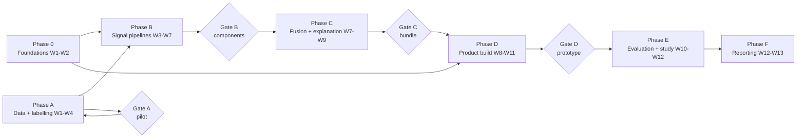

# GuardianLens: FYP2 Engineering Plan

**Status:** Working draft for supervisor review. Schedule is proposal P-8: weeks are relative (W1 to W13 from FYP2 session start) because the official June 2026 session calendar dates were not in the project files read for this plan (open item O-2). Convert to dates the moment O-2 resolves. Current position at the time of writing: Phase A (data collection and labelling) is in progress; the pilot gate has not yet been passed.

**Execution method:** each phase below is a planning unit, not an executable script. Before executing a build phase, expand its tasks into a code-level plan in `docs/plans/` using the working method already adopted for this project: test-first where code is involved, small verifiable steps, frequent commits, exact file paths, and no placeholder steps. This document deliberately does not pre-write the code, because writing untestable code weeks ahead of the data it depends on would manufacture unverified detail.

**Global definition of done (applies to every task):** output exists in the repository or Drive archive; anything trained records seed, pinned dependencies, data split hash, and an archived checkpoint; anything user-facing passes its own validation states; no secrets in the diff; the relevant Chapter 4 note (even three sentences) is written the same week. A task that "works" but leaves no evidence is not done.

---

## 1. Phase map and dependency spine

Hard dependencies that cannot be argued away: fusion needs all three component models and frozen splits; band boundaries need calibration; the user study needs a working prototype, an active bundle with boundaries, and hold-out listings carrying independent evidence; Chapter 5 needs Phase E outputs.

---

## 2. Phase 0: Foundations (W1 to W2, parallel with Phase A)

| ID | Task | Depends on | Done when |
| --- | --- | --- | --- |
| GL-P0-01 | Repository scaffold per the layout in document 02 s.3.3; CI running lint, type checks, unit tests, secret scan | - | A pushed commit runs all checks green |
| GL-P0-02 | Environment pinning: Python and Node versions, lockfiles, one-command dev setup documented | GL-P0-01 | A clean machine reaches a running frontend and API following only the README |
| GL-P0-03 | **Latency spike (de-risking, blocks nothing but informs everything):** load CLIP, SSCD, and XLM-RoBERTa base on CPU; measure per-stage time for 1 and 3 images; record cold-start load time | GL-P0-02 | A dated measurement note in `docs/`; verdict against the 10-second budget; if failed, the mitigation ladder in document 02 s.6 is invoked and the chosen mitigation recorded |
| GL-P0-04 | Model licence verification (open item O-5) for the exact CLIP, SSCD, and XLM-R artefacts to be used | - | Licences recorded per artefact in the registry notes; any incompatibility escalated before Phase B |
| GL-P0-05 | User-study logistics: confirm the INTI ethics/approval requirement (O-3); finalise consent form, session script, and questionnaire from the Ch3 protocol; open recruitment via the survey Section F opt-in list | - | Recruitment message sent; ethics requirement answered in writing; materials filed in `research/` |
| GL-P0-06 | **Second annotator resolution (O-1, critical):** name, brief on the rubric, schedule availability | - | Annotator A2 named in the annotation log and briefed; escalation to Dr. Rajabi if not closed by end of W1 |
| GL-P0-07 | Confirm official FYP2 dates (O-2) and re-anchor this plan | - | This document's weeks carry dates |

---

## 3. Phase A: Data collection and labelling (W1 to W4; in progress)

Method: manual browsing of Mudah.my and Carousell (terms prohibit automation), logged through the existing React collection tool (structured intake, blind per-annotator labelling, live Cohen's kappa, adjudication, CSV export).

| ID | Task | Depends on | Done when |
| --- | --- | --- | --- |
| GL-A-01 | Freeze the written labelling rubric v1: evidence taxonomy, decisive vs non-decisive evidence rules (reverse-image and any model-input cue = non-decisive), uncertainty handling | - | Rubric committed; both annotators sign the log against it |
| GL-A-02 | **Pilot batch:** a fixed pilot set (proposed 60 listings; size to confirm with Dr. Rajabi) dual-labelled blind | GL-A-01, GL-P0-06 | All pilot items carry two independent annotations |
| GL-A-03 | Pilot analysis: Cohen's kappa, disagreement review, fraud-positive yield rate with independent evidence | GL-A-02 | A one-page pilot report: kappa value, yield, rubric amendments |
| **Gate A** | **Pilot gate.** Pass if kappa meets the agreed working target (proposal P-4: at or above 0.61, to confirm) and the fraud-positive yield supports a viable tier. Tier shortfall at the Tier C level goes to Dr. Rajabi immediately; the target is never silently lowered. | GL-A-03 | Signed-off tier decision and any rubric v2 |
| GL-A-04 | Scaled collection to the gated volume targets, dual-labelled, adjudicated | Gate A | Dataset at target counts; every adjudication satisfies the independence constraint (schema-enforced) |
| GL-A-05 | Import to `research` schema; freeze splits (train, val, test, clean_validation) with a versioned hash | GL-A-04, GL-D-01 | `splits` populated; hash recorded; test set access rules stated (single use) |
| GL-A-06 | Reference corpus assembly under a written provenance policy (what may enter, source note mandatory) | GL-A-01 | Corpus loaded with provenance; policy filed; SSCD index built and versioned |
| GL-A-07 | Chapter 4 data section drafted incrementally (collection process, pilot, kappa, tiers, splits) | rolling | Section draft current within one week of the data state |

---

## 4. Phase B: Signal pipelines (W3 to W7; starts on the pilot-cleared portion of data)

| ID | Task | Depends on | Done when |
| --- | --- | --- | --- |
| GL-B-01 | Textual: preprocessing and tokenisation pipeline for Malay, English, mixed; language detection for the FR-04 gate | GL-A-05 | Deterministic pipeline with tests on crafted examples |
| GL-B-02 | Textual: fine-tune XLM-RoBERTa on Colab T4 (class weights, early stopping, stratified validation); Drive checkpoint per epoch; Kaggle fallback rehearsed once | GL-B-01, GL-P0-04 | Best checkpoint archived with seed, pins, config; validation curve saved |
| GL-B-03 | Textual: held-out evaluation (precision, recall, F1, confusion matrix; threshold fixed on validation) | GL-B-02 | Metrics table committed; test set marked consumed for this component protocol |
| GL-B-04 | Visual: CLIP consistency scoring and SSCD corpus matching; thresholds chosen on validation only | GL-A-05, GL-A-06 | Feature extractors deterministic and tested; thresholds recorded |
| GL-B-05 | Visual: held-out evaluation plus the **clean-subset circularity check** (performance on `clean_validation`, whose labels rest on no image-derived cue) | GL-B-04 | Both result sets committed; any clean-subset degradation discussed in Chapter 4, not hidden |
| GL-B-06 | Behavioural: feature builder (account age, rating, review count, active listings, velocity, price deviation vs category baselines, missingness flags); XGBoost training with imbalance handling | GL-A-05 | Model artefact archived with config; feature importances and TreeSHAP sanity-checked |
| GL-B-07 | Behavioural: held-out evaluation as above | GL-B-06 | Metrics table committed |
| GL-B-08 | Missing-signal behaviour tests: suppress each signal in turn, verify availability flags propagate (FR-06 groundwork) | GL-B-03, GL-B-05, GL-B-07 | Edge-case test suite green |
| **Gate B** | All three components have archived artefacts, held-out metrics, confusion matrices, and Chapter 4 component sections drafted | above | Gate note filed; anything anomalous flagged to Dr. Rajabi before fusion |

---

## 5. Phase C: Fusion, calibration, explanation (W7 to W9)

| ID | Task | Depends on | Done when |
| --- | --- | --- | --- |
| GL-C-01 | Out-of-fold component probabilities via five-fold stratified CV (leakage prevention per Ch3) | Gate B | OOF matrix generated and hash-recorded |
| GL-C-02 | Logistic-regression meta-classifier over probabilities + availability indicators; sigmoid calibration via CalibratedClassifierCV | GL-C-01 | Fusion and calibrator artefacts archived |
| GL-C-03 | Calibration evidence: Brier score and reliability plot; fix Low/Moderate/High boundaries on validation and record them (closes O-7) | GL-C-02 | Boundaries in the bundle record with rationale |
| GL-C-04 | Fusion vs best single signal on the held-out set; bootstrap confidence interval where feasible (RQ2) | GL-C-02 | Comparison table committed, honest in either direction |
| GL-C-05 | Ablation: V, T, B, V+T, V+B, T+B, V+T+B on the same test set (RQ3) | GL-C-02 | Seven-row ablation table committed |
| GL-C-06 | SHAP per-signal contributions; explanation template set written and reviewed for plain language; the SSCD scope sentence mandatory in visual templates | GL-C-02 | Template file versioned; example renders reviewed against s.3.3.8 wording rules |
| GL-C-07 | Assemble **model bundle v1** (all artefacts, boundaries, baselines, seeds, dataset hash) and register it | GL-C-03, GL-C-06 | Bundle row exists; loader loads it end to end |
| **Gate C** | Bundle v1 active; RQ1 to RQ3 evidence tables exist; Chapter 4 fusion and ablation sections drafted | above | Gate note filed |

---

## 6. Phase D: Product build (W8 to W11; scaffold work may start at W8 against a stub bundle, real-bundle integration after Gate C)

| ID | Task | Depends on | Done when |
| --- | --- | --- | --- |
| GL-D-01 | Migrations for the document 05 schema (public + research), buckets, RLS posture; confirm current Supabase free-tier limits (O-6) and record them | GL-P0-01 | Migrations applied to a fresh project reproducibly; limits note filed |
| GL-D-02 | FastAPI: assess endpoint set per the document 02 contract; validation (FR-02) incl. unsupported-language gate; PII scrub; session issuing (P-3) | GL-D-01 | Contract tests green, including every 422 case with field-level errors |
| GL-D-03 | Pipeline orchestration against the active bundle; per-stage events; availability handling (FR-06); persistence of results and explanations | GL-C-07, GL-D-02 | A submitted fixture listing yields a stored, replayable result |
| GL-D-04 | Frontend S1 to S3: landing, submission (draft persistence, inline validation, retention notice), processing stages | GL-D-02 | J1 steps 1 to 5 pass on 375 px and 1440 px |
| GL-D-05 | Frontend S4 to S6 + history: result, explanation details, feedback, session history | GL-D-03 | J1 to J4 pass end to end; disclaimer present wherever a score renders |
| GL-D-06 | Admin S7: auth with role check, bundles, corpus, records, exports (FR-14) with export logging | GL-D-01 | J5 passes; non-admin rejection verified |
| GL-D-07 | Security pass: OWASP-derived checklist, ownership tests (cross-session access), signed-URL behaviour, rate limit, secret scan (NFR-06) | GL-D-02..06 | Checklist filed with results; failures fixed or waived in writing |
| GL-D-08 | UX-laws compliance re-run (document 04 s.6 protocol) and accessibility audit (NFR-08); repeatability test (FR-11/NFR-07); performance test against the 10-second budget with stage timings (NFR-02) | GL-D-05 | Audit tables filed; performance evidence recorded; failures block Gate D |
| GL-D-09 | Serving decision executed (P-1): local demo hardened; deploy to a free CPU host only if the confirmed study protocol needs remote access, then re-test latency deployed | GL-D-08 | Decision recorded with Dr. Rajabi's confirmation; demo fallback recording made |
| **Gate D** | Prototype passes J1 to J6, the audits in GL-D-07/08, and renders only from an active bundle with fixed boundaries | above | Gate note filed; study may schedule sessions |

---

## 7. Phase E: Evaluation and user study (W10 to W12)

| ID | Task | Depends on | Done when |
| --- | --- | --- | --- |
| GL-E-01 | Study materials finalised: two matched eight-listing sets (four fraudulent, four legitimate) drawn only from hold-out items with independent evidence; counterbalancing sheet; practice items outside the test set | Gate A data, Gate D | Sets frozen and documented; supervisor sighted |
| GL-E-02 | Run sessions to at least 20 participants (10 per group) per the five-step Ch3 protocol; consent recorded; trials captured in `research.study_trials` | GL-P0-05, GL-E-01 | 20+ complete sessions; deviations logged |
| GL-E-03 | Analysis: paired accuracy via Wilcoxon signed-rank; Cohen's d; decision time; confidence; perceived usefulness; **over-reliance rate** (correct unaided answers flipped to follow an incorrect score) | GL-E-02 | Analysis notebook archived; results reported whatever their direction |
| GL-E-04 | Remaining NFR audits not covered in Phase D: privacy/retention audit (needs O-4 value), transparency wording check, maintainability review | Gate D | Audit evidence filed against Table 3.9 |
| GL-E-05 | FR-14 export integrity check on real exports | GL-D-06 | Field-completeness results filed |
| GL-E-06 | Chapter 4 evaluation sections and Chapter 5 skeleton | GL-E-03 | Drafts exist with real numbers |

---

## 8. Phase F: Reporting and defence (W12 to W13, with W13 as buffer)

Final report assembly from the incrementally written Chapter 4, Chapter 5 conclusions and limitations (reusing the Doc I limitations register honestly against what happened), presentation build, demo rehearsal with the recorded fallback, and the viva answer bank: late fusion vs joint training, XGBoost vs neural, circularity safeguard, thin Malaysian empirical base, the Ch3 "0 - 10" typo, and every proposal-to-decision conversion in document 00.

**Requirements coverage check (self-review):** FR-01/02 → GL-D-02/04; FR-03/04/05 → GL-B-04/01-03/06; FR-06 → GL-B-08, GL-D-03; FR-07/08 → GL-C-02/03; FR-09 → GL-C-06; FR-10 → GL-D-05; FR-11 → GL-D-03 + GL-D-08 repeatability; FR-12/13 → GL-D-05; FR-14 → GL-D-06 + GL-E-05; NFR-01 → GL-E-02 tasks; NFR-02/03/08 → GL-D-08; NFR-05 → GL-E-04; NFR-06 → GL-D-07; NFR-07 → GL-D-08; NFR-09 → module layout + GL-E-04; NFR-10 → GL-D-05 + GL-E-04. No requirement is uncovered; RQ1 to RQ4 map to Gates B, C and Phase E.

---

## 9. Risk register

| Risk | Likelihood | Impact | Control | Trigger and response |
| --- | --- | --- | --- | --- |
| Second annotator not secured | Open now | Kills the agreement claim; Chapter 3 commitment unmet | GL-P0-06 deadline end of W1 | Escalate to Dr. Rajabi with candidate options; do not proceed past the pilot single-annotated |
| Fraud-positive scarcity (Tier C) | Unknown until pilot | Underpowered fraud class | Gate A | Immediate supervisor escalation; scope options discussed, never silent absorption |
| Kappa below target | Unknown until pilot | Weak labels poison everything downstream | Rubric v2 + re-pilot loop at Gate A | Bounded to one iteration before escalation |
| CPU latency exceeds 10 s | Unknown until GL-P0-03 | NFR-02 failure | Early spike; mitigation ladder (image cap, cached index, smaller published variants, then quantisation) | Spike verdict decides; changes recorded in the registry |
| Colab throttling near training deadline | Possible | Blocked fine-tuning | Epoch checkpoints to Drive; Kaggle rehearsed; Colab Pro only on evidenced throttling | Switch environments and resume from checkpoint |
| Supabase free-tier limits or pausing | Possible | Data loss, blocked study | O-6 check at GL-D-01; nightly export of research tables | Trim stored payloads; escalate if the study is at risk |
| Weight licence incompatibility | Low but unchecked | Pipeline rework | GL-P0-04 before any training | Substitute a compatibly licensed variant; record in registry |
| Recruitment shortfall (<20) | Possible | Underpowered RQ4 | Recruitment opened at W1-W2 from the survey opt-in list; reminder wave planned | Extend recruitment into W12; report achieved n honestly with the small-sample caveat already in Doc I |
| Ethics approval needed and slow (O-3) | Unknown | Study delay | Asked in W1 (GL-P0-05) | Re-sequence Phase E; sessions cannot start without the answer |
| Single-developer illness or clash | Always | Schedule slip | W13 buffer; incremental Chapter 4 means the report never starts from zero | Cut Should-scope first (FR-12/13 are the only Shoulds), never Musts or evaluation |
| Scope creep (URL paste, OCR, extension, Malay UI) | Recurring temptation | Time theft from Musts | PRD s.3.3 rejected/future list is binding | Any addition requires a written requirement and supervisor approval first |

---

## 10. Standing weekly rhythm

One short written status to Dr. Rajabi per week: last week's evidence produced, this week's tasks by ID, open risks moving. Every gate produces a one-page note. The register (document 00) is updated the day any proposal converts or any open item closes; the plan is re-anchored the day O-2 resolves.
